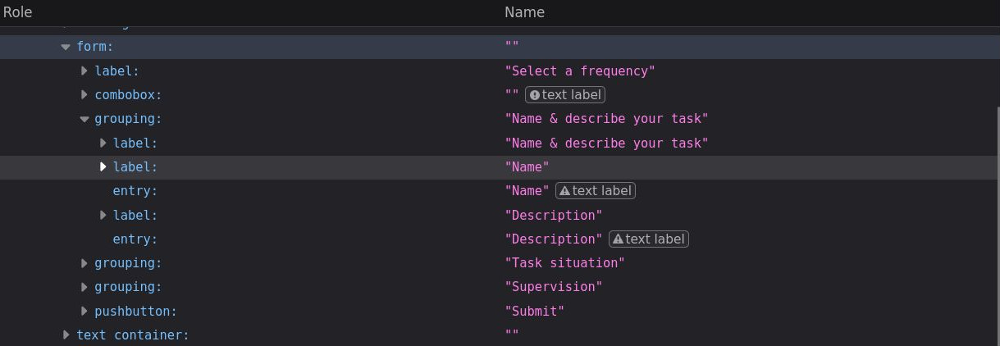
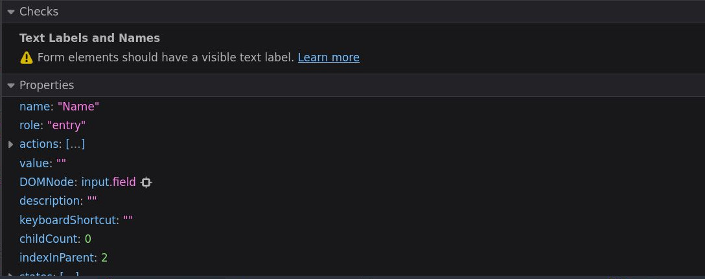

# Accesibilidad

Al final de la última lección, discutimos la importancia de incorporar la accesibilidad en su primera ronda de desarrollo. 

>**No podemos enfatizar esto lo suficiente:** la accesibilidad no es una tarea secundaria a la que regresa después de que su aplicación está funcionando. Es una preocupación principal que debe abordarse como parte de su proceso de desarrollo.

En este curso, decidimos mantenerlo separado por razones educativas, introduciendo un concepto a la vez y construyendo sobre esos conceptos de manera incremental. Ahora tenemos la base conceptual establecida para agregar nuestras funciones de accesibilidad.

Repasaremos lo que consideramos algunos de los conceptos básicos de accesibilidad que debe tener en cuenta al desarrollar formularios.

>Estos conceptos no son técnicamente específicos de Vue, pero aprenderemos cómo aplicarlos en el contexto de nuestros componentes de formulario Vue.

**Vamos a sumergirnos.**

## Tipos apropiados

En **HTML** tenemos una amplia variedad de elementos de entrada para crear nuestros formularios, pero un elemento en particular los gobierna a todos. El `input` **_catch-all_** nos permite la flexibilidad de crear entradas de texto, pero también podemos transformarla en casillas de verificación y botones de opción con la propiedad type.

- `<input type="text">`
- `<input type="checkbox">`
- `<input type="radio">`

Un error común es ignorar esta propiedad de tipo al crear entradas de texto. La mayoría de nosotros conocemos y usamos comúnmente dos regularmente: `type="email"` y `type="password"`.

Cuando usamos un tipo específico en un elemento de entrada, no solo obtenemos un mejor autocompletado para nuestro formulario, sino que también permite a los lectores de pantalla comprender mejor qué tipo de datos queremos recuperar del usuario. Un tipo `tel`, por ejemplo, proporcionará al usuario en un teléfono móvil un práctico teclado numérico con símbolos de teléfono como `+ * #`.

¡Tus usuarios con problemas de movilidad definitivamente te lo agradecerán!

En pocas palabras: no olvide establecer su `type`, incluso cuando el `input` no sea del tipo `password` o `email`.

Aquí hay una tabla de tipos disponibles para un elemento de entrada:

|[`button`](https://developer.mozilla.org/en-US/docs/Web/HTML/Element/input/button)|[`datetime-local`](https://developer.mozilla.org/en-US/docs/Web/HTML/Element/input/datetime-local)|[`image`](https://developer.mozilla.org/en-US/docs/Web/HTML/Element/input/image)|[`radio`](https://developer.mozilla.org/en-US/docs/Web/HTML/Element/input/radio)|[`submit`](https://developer.mozilla.org/en-US/docs/Web/HTML/Element/input/submit)|[`url`](https://developer.mozilla.org/en-US/docs/Web/HTML/Element/input/url)|
|:---:|:---:|:---:|:---:|:---:|:---:|
|[`checkbox`](https://developer.mozilla.org/en-US/docs/Web/HTML/Element/input/checkbox)|[`email`](https://developer.mozilla.org/en-US/docs/Web/HTML/Element/input/email)|[`month`](https://developer.mozilla.org/en-US/docs/Web/HTML/Element/input/month)|[`range`](https://developer.mozilla.org/en-US/docs/Web/HTML/Element/input/range)|[`tel`](https://developer.mozilla.org/en-US/docs/Web/HTML/Element/input/tel)|[`week`](https://developer.mozilla.org/en-US/docs/Web/HTML/Element/input/week)|
|[`color`](https://developer.mozilla.org/en-US/docs/Web/HTML/Element/input/color)|[`file`](https://developer.mozilla.org/en-US/docs/Web/HTML/Element/input/file)|[`number`](https://developer.mozilla.org/en-US/docs/Web/HTML/Element/input/number)|[`reset`](https://developer.mozilla.org/en-US/docs/Web/HTML/Element/input/reset)|[`text`](https://developer.mozilla.org/en-US/docs/Web/HTML/Element/input/text)|...|
|[`date`](https://developer.mozilla.org/en-US/docs/Web/HTML/Element/input/date)|[`hidden`](https://developer.mozilla.org/en-US/docs/Web/HTML/Element/input/hidden)|[`password`](https://developer.mozilla.org/en-US/docs/Web/HTML/Element/input/password)|[`search`](https://developer.mozilla.org/en-US/docs/Web/HTML/Element/input/search)|[`time`](https://developer.mozilla.org/en-US/docs/Web/HTML/Element/input/time)|...|


## Usar Conjunto de Campos y Leyenda

>Dos elementos a menudo pasados por alto o poco enseñados en **HTML** son el [conjunto de campos](https://developer.mozilla.org/en-US/docs/Web/HTML/Element/fieldset) y la [leyenda](https://developer.mozilla.org/en-US/docs/Web/HTML/Element/legend).

En los formularios, generalmente agrupamos nuestroas entradas de forma lógica. Por ejemplo, normalmente codificaría su formulario para que primero le pida al usuario sus datos personales como Nombre, Apellido y Teléfono. Más adelante, otra sección puede pedirles una dirección de envío.

Para los [usuarios accesibles](https://www.w3.org/WAI/fundamentals/accessibility-usability-inclusion/), es posible que esta información no esté disponible inmediatamente sin tener que pasar por todo el formulario, aquí es donde entran en juego `<fieldset>` y `<legend>`.

Siempre debe intentar envolver secciones de su formulario dentro de un elemento `fieldset`. Esto agrupará lógicamente las entradas dentro de él. Luego, el primer elemento del conjunto de campos será un elemento `legend` que proporcionará un **Título** para ese conjunto de campos en particular.

Si por alguna razón no desea que la leyenda se muestre en su formulario (generalmente por razones de diseño), siempre puede colocarla de manera absoluta, fuera de la pantalla visible.

Para nuestro formulario actual en `TasksForm.vue`, podemos envolver nuestras secciones lógicas dentro de `fieldset` como en el siguiente ejemplo:

📃`TasksForm.vue`
```vue{13,14,25,27,28,36,38,39,54}
<script setup lang="ts">
// omitted for brevity ...
</script>

<template>
  <form @submit.prevent="sendForm">
    <AppSelect
      :options="frequencies"
      v-model="form.frequency"
      label="Select a frequency"
    />

    <fieldset>        
      <legend>Name & describe your task</legend>
      <AppInput
        v-model="form.name"
        label="Name"
        type="text"
      />
      
      <AppTextarea
        v-model="form.description"
        label="Description"      
      />
    </fieldset>

    <fieldset>
      <legend>Task situation</legend>
      <div>
        <AppRadioGroup
          v-model="form.situation"
          name="situation"
          :options="situationOptions"
        />
      </div>
    </fieldset>

    <fieldset>
      <legend>Supervision</legend>
   
      <div>
        <AppCheckbox
          v-model="form.supervision.reviewed"
          label="Reviewed"
        />
      </div>

      <div>
        <AppCheckbox
          v-model="form.supervision.approved"
          label="Approved"
        />
      </div>
    </fieldset>

    <button
      class="btn btn-primary"
      type="submit"
    >
      Submit
    </button>
  </form>
</template>
```

Podemos agregar una etiqueta de estilo para eliminar los bordes y márgenes predeterminados, y diseñar las etiquetas de leyenda como teníamos antes con los encabezados.

📃`TasksForm.vue`
```vue
<script setup lang="ts">
// omitted for brevity ...
</script>

<template>
  <!-- omitted for brevity ... -->
</template>

<style scoped>
fieldset { 
  @apply border-0 m-0 p-0;
}

legend {
  @apply text-2xl font-semibold my-4;
}
</style>
```

Cabe señalar que **FireFox** tiene una herramienta de inspección de `Accessibility` muy buena.

Revisando la pestaña de `Accessibility`, puede ver como ahora la agrupación lógica de nuestro formulario será entendida por los lectores de pantalla.



## NO confíe en `placeholders`

>Un patrón de diseño popular que surgió hace unos años usaba el atributo [`placeholders`](https://developer.mozilla.org/es/docs/Web/CSS/::placeholder) de las entradas para describir el tipo de contenido que esperaba el elemento. Lamentablemente, esto todavía se usa a veces en la actualidad en lugar de una etiqueta adecuada.

Los `placeholders` solo deben usarse para describir el valor previsto, pero no como reemplazo de una etiqueta descriptiva. Los `placeholders` desaparecen cada vez que un usuario comienza a escribir en el campo, lo que obliga al usuario a tener en cuenta lo que esperaba ese campo. Además, algunos usuarios pueden tener problemas para diferenciar entre un campo con un `placeholders` y un campo que tiene contenido rellenado o rellenado previamente.

En lo que respecta a los lectores de pantalla, cada lector de pantalla puede tratar el atributo `placeholders` de manera diferente, pero siempre que haya una `lebel` establecido correctamente, no debería ser una gran preocupación dejarlo.

## Labels

Hablando de etiquetas, hablemos de una característica de accesibilidad realmente poderosa que, lamentablemente, se usa muy poco o mal en los formularios.

Si navegamos a **FireFox** nuevamente en la pestaña de `Accessibility` e inspeccionamos nuestra entrada **Name**, podemos ver un ícono ⚠️ justo al lado. Esto significa que tenemos un problema.



Echemos un vistazo al panel de información. La sección `Checks` ya nos dice el problema: **_“Form elements should have a visible text label”_**.

Esto puede ser una sorpresa, ya que nuestro campo **'Name'** claramente tiene una etiqueta encima que describe lo que pretendemos para esta entrada.


Para nuestros usuarios videntes, sin embargo, esto no es evidente. Todavía no hemos vinculado estos dos elementos **HTML**, y esa es una suposición que un lector de pantalla no puede darse el lujo de hacer. ¡Afortunadamente, esta es una solución muy fácil!

Hay algunas formas de vincular un elemento `input` con su `label`, la primera es anidar el `input` dentro del elemento de `label`.

```html
<label>
  Title
  <input />
</label>
```

Esta es una de las formas más fáciles de asegurarse de que su `input` siempre esté correctamente vinculado al `label` relacionado, pero queremos profundizar en la segunda y generalmente más _"común"_ forma de relacionar elementos **HTML** porque será útil más adelante cuando veamos los componentes [`ErrorMessage`](../guide/error-message.html). Este método implica el uso de identificaciones.

