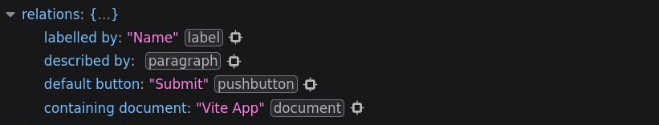
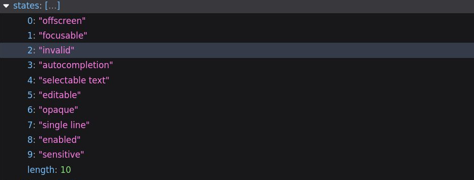

# Errores Accesibles

>¿Alguna vez llenó un formulario solo para presionar el botón de enviar y nada parecía funcionar? Claramente no se estaba enviando, y no había ningún error visible en ninguna parte, sin embargo, algo estaba claramente mal. Esta situación no es ajena a la mayoría de los usuarios de Internet, pero imagine la exasperación cuando necesita herramientas accesibles y el formulario no le dice fácilmente cuál es el problema con sus entradas.

Primero vayamos a nuestro componente `AppInput.vue` y agreguemos una nueva propiedad, `error`, que nos permitirá establecer una cadena con un mensaje de error en caso de que el componente se encuentre en un estado de error.

📃`AppInput.vue`
```ts{4,8}
withDefaults(defineProps<{
  label?: string
  modelValue?: string | number
  error?: string
}>(), {
  label: '',
  modelValue: '',
  error: ''
})
```

Mostraremos este `error` debajo de nuestro campo `input` cada vez que haya un `error` presente, si la propiedad de `error` se establece en algo que no sea una cadena vacía.

📃`AppInput.vue`
```vue{11,12,13,14,15,16}
<template>
  <label :for="uuid" v-if="label">{{ label }}</label>
  <input
    v-bind="$attrs"
    :value="modelValue"
    :placeholder="label"
    @input="$emit('update:modelValue', ($event.target as HTMLInputElement).value)"
    class="field"
    :id="uuid"  
  >
  <p
    v-if="error"
    class="errorMessage"
  >
    {{ error }}
  </p>
</template>
```

También volveremos a `TasksForm.vue` y agregaremos un mensaje de `error` a nuestra entrada **'Name'**, para que podamos ver cómo se comporta en el navegador. Tenga en cuenta que también agregamos una clase de mensaje `error` que simplemente lo coloreará de rojo.


📃`TasksForm.vue`
```html{5}
<AppInput
  v-model="form.name"
  label="Name"
  type="text"
  error="This input has an error!"
/>
```

Ahora echemos un vistazo al navegador, el `error` se muestra correctamente debajo del título una vez que se establece la propiedad `error`. Tenga en cuenta que si tuviera más componentes `AppInput` dentro del formulario `TasksForm`, estos otros no mostrarán ningún `error` porque la propiedad `error` no están configuradas en nada para ellos.


Si abrimos nuestra pestaña de **Accessibility** en Firefox una vez más e inspeccionamos el elemento `input`, podemos ver que no hay nada que vincule el `error` con el `input` del nombre real. Aquí es donde la mayoría de los formularios se quedan cortos. El hecho de que el mensaje `error` esté "cerca" del `input` no significa que un lector de pantalla pueda identificarlo como parte del `error`.

>Afortunadamente, hay una solución sencilla a este problema: el atributo [`aria-describedby`](https://developer.mozilla.org/en-US/docs/Web/Accessibility/ARIA/Attributes/aria-describedby). Este atributo nos permite establecer directamente en el elemento de entrada qué otros elementos lo describen.

El atributo puede tomar una lista de cadenas de **ID** para otros elementos **HTML** en la página, así que primero agregaremos una **ID** único a nuestra etiqueta. Por suerte, ya tenemos un número **UUID** asociado a la instancia del componente para hacerlo.

Volvamos a `AppInput` y agreguemos el vínculo `id` a la etiqueta `p` de `error`.

📃`AppInput.vue`
```html
<p
  v-if="error"
  class="errorMessage"
  :id="`${uuid}-error`"
>
  {{ error }}
</p>
```

Tenga en cuenta que estamos agregando la cadena `-error` al `UUID`. Necesitamos que este identificador sea único, y el `UUID` en sí mismo ya está en uso por el `input`.

Ahora que nuestro mensaje de error tiene un **ID** único, podemos establecerlo como una _"descripción"_ para el elemento `input` con el atributo `aria-describedby`.

📃`AppInput.vue`
```vue{10}
<template>
  <label :for="uuid" v-if="label">{{ label }}</label>
  <input
    v-bind="$attrs"
    :value="modelValue"
    :placeholder="label"
    @input="$emit('update:modelValue', ($event.target as HTMLInputElement).value)"
    class="field"
    :id="uuid"    
    :aria-describedby="error ? `${uuid}-error` : undefined"
  >
  <p
    v-if="error"
    class="errorMessage"
    :id="`${uuid}-error`"
  >
    {{ error }}
  </p>
</template>
```

Tenga en cuenta que estamos agregando una verificación secundaria para ver si se establece un `error`. Esto nos permite un poco de higiene en la relación entre nuestros elementos: cuando no hay ningún `error` presente, no se mostrará ningún mensaje de `error` y la identificación no apuntará a nada.

Si volvemos a revisar nuestro navegador, podemos ver que cuando el `error` está presente, una nueva descripción por entrada está presente en el objeto de relación de la entrada.



Sin embargo, una cosa más... Debido a que estamos usando `v-if` para mostrar esta información de forma intermitente, queremos asegurarnos de que los lectores de pantalla la anuncien o la lean cada vez que se muestre. Para hacer esto, agregaremos un atributo `aria-live="asertive"`. Otra forma sería agregar un atributo `rol` de `"alert"`, pero descubrimos que [`aria-live`](https://developer.mozilla.org/en-US/docs/Web/Accessibility/ARIA/Attributes/aria-live) tiende a funcionar mejor con un variedad de lectores de pantalla.

📃`AppInput.vue`
```html
<p
  v-if="error"
  class="errorMessage"
  :id="`${uuid}-error`"
  aria-live="assertive"
>
  {{ error }}
</p>
```

## Estado de entrada explícito

Otra cosa que podemos agregar rápidamente a nuestra entrada para que sea aún más accesible es el atributo [`aria-invalid`](https://developer.mozilla.org/en-US/docs/Web/Accessibility/ARIA/Attributes/aria-invalid). Un error que se comete en muchos formularios es tratar de confiar en un borde rojo alrededor de una entrada no válida. Por razones obvias, esto no es accesible.

Ya hemos tomado medidas en errores accesibles, pero asegurémonos de notificar también a los lectores de pantalla sobre el estado no válido de una entrada para proporcionar mejores comentarios a nuestros usuarios.

Vamos a agregar el atributo `aria-invalid` a nuestra entrada, y lo activaremos y desactivaremos dependiendo de si la propiedad `error` está establecida. Cuando la entrada es válida, `undefined` hará que la propiedad no se agregue al elemento de entrada.

📃`AppInput.vue`
```html{9}
<input
  v-bind="$attrs"
  :value="modelValue"
  :placeholder="label"
  @input="$emit('update:modelValue', ($event.target as HTMLInputElement).value)"
  class="field"
  :id="uuid"    
  :aria-describedby="error ? `${uuid}-error` : undefined"
  :aria-invalid="error ? true : undefined"
>
```

Si volvemos al navegador e inspeccionamos la entrada usando la herramienta de **Accessibility** en **Firefox**, podemos ver que el estado `"invalid"` ahora se ha agregado a los estados activos del `input`.



Otros estados dignos de mención a los que también podríamos agregar atributos son de `readonly`, `disabled` y `required`. Estos tres se pueden establecer directamente con atributos **HTML5** del mismo nombre, o con sus contrapartes aria: [`aria-readonly`](https://developer.mozilla.org/en-US/docs/Web/Accessibility/ARIA/Attributes/aria-readonly), [`aria-disabled`](https://developer.mozilla.org/en-US/docs/Web/Accessibility/ARIA/Attributes/aria-disabled) y [`aria-required`](https://developer.mozilla.org/en-US/docs/Web/Accessibility/ARIA/Attributes/aria-required).

## No deshabilites el botón de enviar

Si un formulario no es válido, tiene sentido establecer el atributo `disabled` en `true` en el botón `submit` para que el usuario no pueda enviar el formulario, ¿verdad? Incluso podemos diseñar el botón con un color diferente para transmitir que no se podrá hacer click en él.

Sin embargo, hay un gran problema con esto. Los usuarios que confían en los lectores de pantalla no recibirán ningún comentario, el lector de pantalla ignorará por completo el botón al navegar por el formulario. Esto claramente puede ser muy confuso y frustrante.

En su lugar, sugiero que realice todas y cada una de las comprobaciones para asegurarse de que su formulario sea válido antes de enviarlo en el método `sendForm` que creamos en `TasksForm`. Si todo sale bien, enviamos el formulario normalmente.

Si algo está mal, establesca los errores necesarios en su formulario con las herramientas que acabamos de aprender para notificar al usuario que algo está mal.

## Terminando

Como puede ver, con unas pocas líneas rápidas de **HTML** y algunos accesorios colocados estratégicamente, logramos convertir nuestro componente **AppInput** en algo mucho más accesible.

Sin embargo, quiero enfatizar que, en lo que respecta al tema de la accesibilidad, esto solo comienza a arañar la superficie. ¡Pero con estos pocos consejos, deberíamos poder establecer el rumbo para una forma más inclusiva y accesible para nuestros proyectos!

