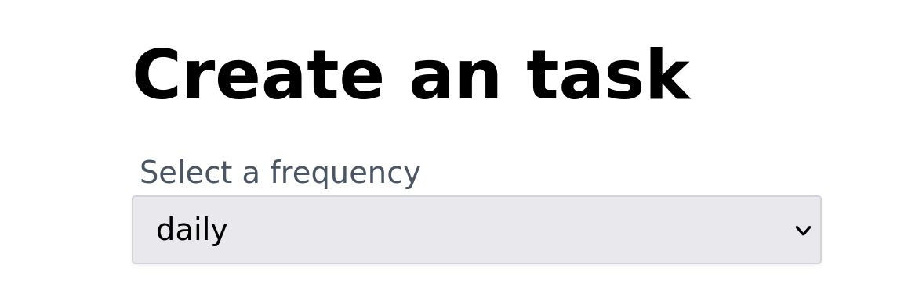

# Componente Select

En nuestra lección anterior, aprendimos cómo crear nuestro primer componente de formulario reutilizable, `AppInput`. En esta lección, vamos a aprender cómo construir nuestro segundo componente, `AppSelect`.

**¡Vamos a sumergirnos!**

## `AppSelect.vue`

>Nuestro objetivo para esta lección es convertir este código en un componente reutilizable, tal como lo hicimos para `AppInput.vue` en la lección anterior.

Actualmente, en nuestro formulario de ejemplo, tenemos el siguiente elemento de selección.

📃`TasksForm.vue`

```html
<label>Select a frequency</label>
<select v-model="form.frequency">
  <option
    v-for="option in frequencies"
    :value="option"
    :key="option"
    :selected="option === form.frequency"
  >{{ option }}</option>
</select>
```
Como hicimos con el elemento `AppInput`, vamos a crear un nuevo archivo de componente llamado `AppSelect.vue` y comenzaremos copiando el elemento de selección, junto con su etiqueta correspondiente, en el nuevo archivo dentro de una etiqueta `template`.

📃`AppSelect.vue`
```vue
<template>
  <label>Select a frequency</label>
  <select v-model="form.frequency">
    <option
      v-for="option in frequencies"
      :value="option"
      :key="option"
      :selected="option === form.frequency"
    >{{ option }}</option>
  </select>
</template>
```

Para que nuestro componente sea flexible, debemos permitir que el padre pueda modificar y proporcionar detalles de contenido, como el `label`.

Al igual que hicimos en `AppInput`, nuestro primer paso será agregar una propiedad llamada `label` y aplicar los contenidos en nuestro elemento `<label>` mediante interpolación.

📃`AppSelect.vue`
```vue{3,5,10}
<script setup lang="ts">
withDefaults(defineProps<{
  label?: string  
}>(), {
  label: ''
})
</script>

<template>  
  <label v-if="label">{{ label }}</label>
  <select v-model="form.frequency">
    <option
      v-for="option in frequencies"
      :value="option"
      :key="option"
      :selected="option === form.frequency"
    >{{ option }}</option>
  </select>
</template>
```

## Preparándolo para el `v-model`

Al igual que hicimos en `AppInput`, queremos asegurarnos de que nuestro componente `AppSelect` esté listo para el `v-model`, de esa manera, cada vez que lo use nuestro formulario principal, o cualquier otro formulario, se puede usar fácilmente con un doble vínculo directamente en nuestro estado de los padres.

Los elementos `<select>` tienen un par de diferencias y trampas, así que echemos un vistazo a eso.

Lo primero que debemos hacer es eliminar la declaración anterior del `v-model` del código que pegamos del formulario original.

📃`AppSelect.vue`
```vue{3}
<template>  
  <label v-if="label">{{ label }}</label>
  <select>
    <option
      v-for="option in frequencies"
      :value="option"
      :key="option"
      :selected="option === form.frequency"
    >{{ option }}</option>
  </select>
</template>
```

A continuación, agregaremos la propiedad `modelValue` al componente y vincularemos el atributo `value` del elemento `<select>`.

Recuerde que `modelValue` es el nombre predeterminado de la propiedad que Vue buscará cuando realice un doble vínculo a través de `v-model` a componentes personalizados.

Mientras estamos en eso, también agregaremos `class="field"` al elemento `<select>` para que se vea mejor.

📃`AppSelect.vue`
```vue{4,7,14,15}
<script setup lang="ts">
withDefaults(defineProps<{
  label?: string
  modelValue?: string | number
}>(), {
  label: '',
  modelValue: ''
})
</script>

<template>  
  <label v-if="label">{{ label }}</label>
  <select
    :value="modelValue"
    class="field"
  >
    <option
      v-for="option in frequencies"
      :value="option"
      :key="option"
      :selected="option === form.frequency"
    >{{ option }}</option>
  </select>
</template>
```

Ahora que el vínculo `value` del elemento `select` está establecido, tenemos que agregar la segunda parte del contrato del `v-model`: el **`emit`**.

Esta parte del vínculo permitirá que nuestro componente comunique a su padre que los datos han cambiado y deben actualizarse en el estado del padre.

Los elementos `<select>` activan un evento `change` cada vez que el usuario realiza una nueva selección, por lo que, a diferencia de nuestro componente `AppInput`, vamos a escuchar el evento `change` del elemento `<select>`.

Dado que también necesitaremos vincular `$attrs` a nuestro elemento `<select>` como lo hicimos en el elemento `<input>` para `AppInput`, los abordaremos juntos y los vincularemos usando la sintaxis `v-bind`.

Dado que `$attrs` es un objeto, podemos usar el operador de propagación `spread` de JavaScript para combinar nuestros vínculos en un solo objeto. Primero propagaremos los `$attrs` en nuestro `v-bind` y luego vincularemos el evento `change` en nuestro `v-bind`.

📃`AppSelect.vue`
```vue{16,17,18,19}
<script setup lang="ts">
withDefaults(defineProps<{
  label?: string
  modelValue?: string | number
}>(), {
  label: '',
  modelValue: ''
})
</script>

<template>  
  <label v-if="label">{{ label }}</label>
  <select
    class="field"
    :value="modelValue"    
    v-bind="{
      ...$attrs,
      onChange: ($event) => { $emit('update:modelValue', ($event.target as HTMLInputElement).value) }
    }"
  >
    <option
      v-for="option in frequencies"
      :value="option"
      :key="option"
      :selected="option === form.frequency"
    >{{ option }}</option>
  </select>
</template>
```

Tenga en cuenta que esta vez no estamos usando un vínculo directo configurando nuestro detector de eventos `change` con la palabra clave `@change` como hicimos en nuestro componente `AppInput` para el evento `@input`. Esta vez estamos configurando nuestro vínculo de eventos directamente en el objeto `v-bind`, después de nuestro vínculo `$attrs`.

En Vue 3, es importante recordar que si elegimos no usar la sintaxis del signo `@`, el evento tendrá como prefijo la palabra clave `on`, en este caso `onChange`, ya que estamos detectando el evento `change`.

Todos los detectores de eventos que se reciben en `$attrs` desde el padre tienen como prefijo la palabra clave `on` y la primera letra está en mayúscula.

En nuestro detector de eventos para `onChange`, capturamos `$event` como el parámetro de la función y emitimos nuestro evento `update:modelValue` con la carga útil de `$event.target.value` para notificar al padre sobre cualquier cambio.

## Seleccionando la opción correcta

Quiero llamar su atención sobre el bucle `v-for` que tenemos actualmente en el elemento `<option>` en nuestro `<select>`. Tenga en cuenta que estamos recorriendo el arreglo de `frequencies` que no existe en nuestro componente. Esto está estrechamente relacionado con lo que el padre está tratando de hacer con esta entrada en particular.

Para que nuestro componente `AppSelect` funcione con cualquier conjunto de opciones, primero crearemos una propiedad `options` para que nuestro componente pueda recibir esta información del padre. Luego, cambiaremos el nombre `frequencies` a `options` en nuestro ciclo `v-for`.

📃`AppSelect.vue`
```vue{5,23}
<script setup lang="ts">
withDefaults(defineProps<{
  label?: string
  modelValue?: string | number
  options: array
}>(), {
  label: '',
  modelValue: ''
})
</script>

<template>  
  <label v-if="label">{{ label }}</label>
  <select
    class="field"
    :value="modelValue"    
    v-bind="{
      ...$attrs,
      onChange: ($event) => { $emit('update:modelValue', ($event.target as HTMLInputElement).value) }
    }"
  >
    <option
      v-for="option in options"
      :value="option"
      :key="option"
      :selected="option === form.frequency"
    >{{ option }}</option>
  </select>
</template>
```

La segunda cosa que debemos corregir es el vínculo `:selected` para el bucle del elemento `<options>`. Actualmente, estamos tratando de verificar si la opción actual que estamos recorriendo es igual a `form.frequency`, que también está estrechamente relacionada con el padre.

En este caso, podemos cambiar esto de manera segura para verificar que `option` es igual a `modelValue`, y eso satisfará el requisito de HTML para que la opción se actualice cada vez que cambie el `modelValue`.

📃`AppSelect.vue`
```vue{15}
<template>  
  <label v-if="label">{{ label }}</label>
  <select
    class="field"
    :value="modelValue"    
    v-bind="{
      ...$attrs,
      onChange: ($event) => { $emit('update:modelValue', ($event.target as HTMLInputElement).value) }
    }"
  >
    <option
      v-for="option in options"
      :value="option"
      :key="option"      
      :selected="option === modelValue"
    >{{ option }}</option>
  </select>
</template>
```

Con estos cambios, ahora podemos volver a nuestro formulario y cambiar el elemento `select` por nuestro nuevo `AppSelect`, y verificarlo en el navegador.

## Actualizando el formulario

De vuelta al `TasksForm.vue`, tenemos un elemento `<select>` en la parte superior del formulario, etiquetado como _"Select a frequency"_. 

Reemplacemos los correspondientes elementos `<label>` y `<select>` por nuestro componente `AppSelect.vue`.

📃`TasksForm.vue`
```html
<AppSelect
  :options="frequencies"
  v-model="form.frequency"
  label="Select a frequency"
/>
```

Agregue la respectiva importación.

```vue{4}
<script setup lang="ts">
import { reactive } from "vue"
import AppInput from "@/components/AppInput.vue"
import AppSelect from '@/components/AppSelect.vue'

// omitted for brevity ...
```

Si revisamos nuestro formulario en el navegador, podemos ver que nuestro `dropdown` aún funciona como se esperaba, ahora impulsado detrás de escena por nuestro componente de formulario reutilizable.



## Terminando

En esta lección, aprendimos a crear un componente `AppSelect` reutilizable.

¿Ha notado que hemos tenido que importar `AppInput` y `AppSelect` en nuestro componente `TasksForm.vue` antes de usarlos? En nuestra próxima lección, veremos cómo importar componentes globales. Después de todo, los reutilizaremos muchas veces.

