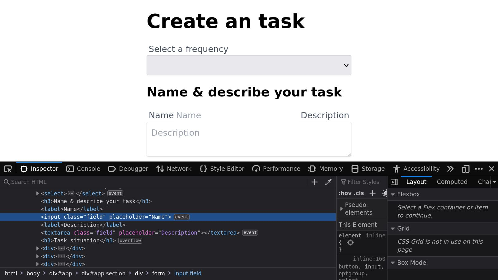
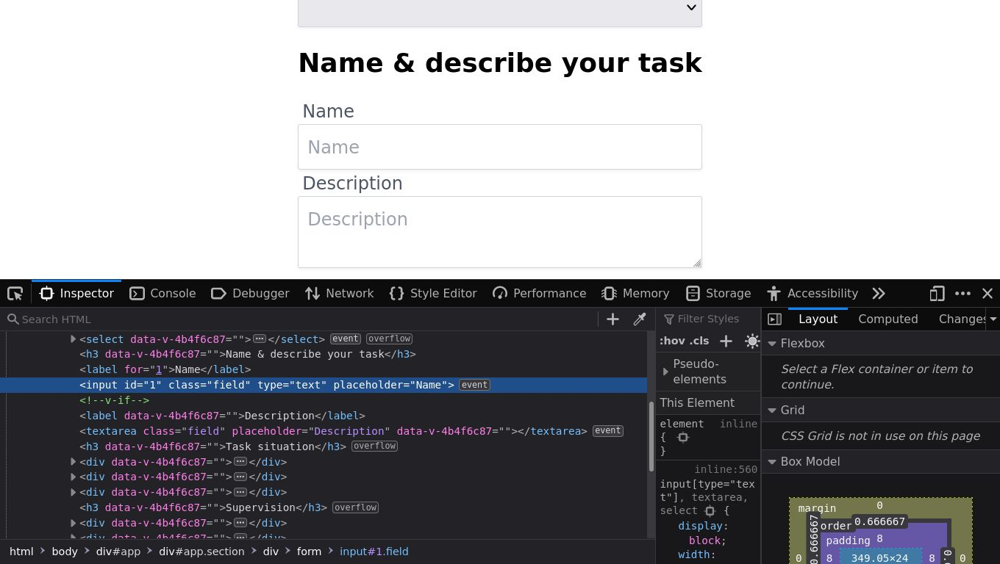

# Componente Input

## `AppInput.vue`

>El objetivo de esta lección es crear el componente `AppInput.vue`.

Cada vez que construyamos formularios en Vue, la creación de componentes reutilizables para cada tipo de entrada específico nos permitirá replicarlos, modificarlos y también ampliarlos fácilmente.

Esto también asegura que todos nuestros formularios de solicitud sean consistentes.

## Crear el Archivo

Empecemos creando el archivo `AppInput.vue` en nuestra carpeta `components`.

📃`AppInput.vue`
```vue
<script setup lang="ts"></script>

<template></template>

<!--style scoped></style-->
```
>Con el propósito de mantener una standar en nuestros [SFC](https://vuejs.org/api/sfc-spec.html) seguiremos este ejemplo de plantillas. Tenga en cuenta que la sección `<style>` se colocará cuando así lo amerite.

Seguidamente copiamos el elemento `input` con su `label`, tal como están actualmente en el formulario simple de demostración, y lo pegaremos en la plantilla del nuevo componente; vamos a transformar este código estático en algo más reutilizable y flexible. Después de todo, ¡ese es el beneficio de fabricar componentes!

📃`AppInput.vue`
```vue
<template> 
  <label>Name</label>
  <input
    v-model="form.name"
    type="text"
    placeholder="Name"
    class="field"
  >  
</template>
```

>En Vue 3 podemos tener múltiples nodos raíz. Esto significa que podemos tener el `label` y el `input` en el nivel raíz sin necesidad de envolverlos en un único elemento raíz como un `div` - como teníamos que hacer en Vue 2.

## Propiedad `label`

Lo primero que debemos hacer es permitir que nuestro componente reciba una propiedad `label` del padre. Para hacer esto, vamos a crear una propiedad `label`. Esta propiedad se usará no solo para nuestro elemento `<label>`, sino también como `placeholder`, por lo que es muy conveniente que solo tengamos que definirlo una vez en el padre.

📃`AppInput.vue`
```vue
<script setup lang="ts">

withDefaults(defineProps<{
  label?: string
}>(), {
  label: ''
})

</script>
```

Tenga en cuenta que la propiedad `label` es de tipo `string`. Su valor por defecto será una cadena vacia en caso de no ser suministrada.

Ahora podemos usar nuestra nueva propiedad `label` a través de la interpolación dentro del elemento `<label>` de nuestro plantilla.

📃`AppInput.vue`
```vue{2}
<template>
  <label v-if="label">{{ label }}</label>
  <input
    v-model="form.name"
    type="text"
    placeholder="Name"
    class="field"
  >
</template>
```

Mientras estamos en eso, vamos a eliminar la directiva `v-model` ya que ya no la usaremos dentro del componente. Volveremos a usar `v-model` más adelante.

También eliminaremos `type`, porque el padre lo proporcionará como parte de los `attrs`; recuerde que queremos mantener el componente lo más flexible posible.

>El usuario de este componente puede querer que sea de tipo `email` o `password`, y el valor predeterminado para la entrada ya es de tipo `text`, si no se declara.

Finalmente, vinculemos también el atributo `placeholder` a nuestra propiedad `label`. Esto asegurará que tanto el texto de `placeholder`, dentro del elemento `<input>`, como el `label` estén coordinados y sean reactivos.

📃`AppInput.vue`
```vue{13}
<script setup lang="ts">
withDefaults(defineProps<{
  label?: string
}>(), {
  label: ''
})
</script>

<template>
  <label v-if="label">{{ label }}</label>
  <input
    :placeholder="label"
    class="field"    
  >
</template>
```

Ahora que nuestro componente tiene su estructura básica, podemos pasar a agregar la capacidad para que nuestro componente esté listo para el `v-model`.

## `v-model`: Vinculando el `value`

De forma predeterminada en Vue 3, `v-model` espera que una propiedad llamada `modelValue` esté en su componente compatible con `v-model`. Avancemos y agreguemos esta nueva propiedad, y luego la vincularemos al atributo `value` de nuestro elemento `<input>`.

Lo usaremos por defecto como una cadena vacía, pero especificaremos `string` y `number` como los tipos permitidos.

Existe una buena posibilidad de que el padre intente vincular un texto o una cadena como _`'Hello'`_ a nuestra entrada, pero también puede intentar vincular un valor numérico, como la edad del usuario o _`30`_; debemos poder permitir que sea establecido.


📃`AppInput.vue`
```vue{4,7,14}
<script setup lang="ts">
withDefaults(defineProps<{
  label?: string
  modelValue?: string | number
}>(), {
  label: '',
  modelValue: ''
})
</script>

<template>
  <label v-if="label">{{ label }}</label>
  <input
    :value="modelValue"
    :placeholder="label"
    class="field"    
  >
</template>
```

Ahora que tenemos nuestra propiedad `modelValue` establecida y vinculada al atributo `value` del elemento `<input>`, veamos la segunda parte del enlace bidireccional del `v-model`: emitir un evento.

## `v-model`: Emitiendo el evento `update:modelValue`

Todos los componentes que pueden ser _"v-modelados"_ deben emitir un evento para que el padre pueda capturar las actualizaciones de los datos de ese componente.

En Vue 3, de forma predeterminada, todos los contratos `v-model` esperan que su componente emita un evento `update:modelValue`, independientemente del tipo de entrada o entradas que contenga su componente.

Avancemos y agreguemos un detector de eventos `@input` a nuestro elemento `<input/>` y emitamos un evento `update:modelValue` cada vez que ocurra un evento de entrada.


📃`AppInput.vue`
```vue{16}
<script setup lang="ts">
withDefaults(defineProps<{
  label?: string
  modelValue?: string | number
}>(), {
  label: '',
  modelValue: ''
})
</script>

<template>
  <label v-if="label">{{ label }}</label>
  <input
    :value="modelValue"
    :placeholder="label"
    @input="$emit('update:modelValue', ($event.target as HTMLInputElement).value)"
    class="field"    
  >
</template>
```

Agregar un detector `@input` a nuestro elemento de entrada nos permite activar el evento requerido cada vez que el usuario escribe algo en el campo de entrada.

Tenga en cuenta que estamos pasando el `$event.target.value` como la carga útil del evento. Este es el valor que el `v-modelo` recibirá en el padre.

## Componente padre `TaskForm.vue`

Hablando del padre, regresemos a nuestro formulario y usemos nuestro nuevo componente `AppInput.vue` en lugar de nuestro elemento nativo para probar nuestro código.

Reemplacemos la entrada de `Name` en nuestro formulario con nuestro nuevo componente.

📃`TaskForm.vue`

```html{13,14,15,16,17}
  <form>
    <label>Select a frequency</label>
    <select v-model="form.frequency">
      <option
        v-for="option in frequencies"
        :value="option"
        :key="option"
        :selected="option === form.frequency"
      >{{ option }}</option>
    </select>

    <h3>Name & describe your task</h3>
    <AppInput
      v-model="form.name"
      label="Name"
      type="text"
    />

    <label>Description</label>
    <textarea                          
      v-model="form.description"
      placeholder="Description"
      class="field"
    ></textarea>

    <h3>Task situation</h3>
    <div>
      <input
        type="radio"
        v-model="form.situation"
        :value="0"
        name="situation"
      />
      <label>Unstarted</label>
    </div>

    <div>
      <input
        type="radio"
        v-model="form.situation"
        :value="1"
        name="situation"
      />
      <label>Started</label>
    </div>    
    
    <div>
      <input
        type="radio"
        v-model="form.situation"
        :value="2"
        name="situation"
      />
      <label>Completed</label>
    </div>

    <h3>Supervision</h3>
    <div>
      <input
        type="checkbox"
        v-model="form.supervision.reviewed"
        class="field"
      />
      <label>Reviewed</label>
    </div>

    <div>
      <input
        type="checkbox"
        v-model="form.supervision.approved"
        class="field"
      />
      <label>Approved</label>
    </div>

    <button
      class="btn btn-primary"
      type="submit"
    >
      Submit
    </button>
  </form>    
```

Recordemos que para que esto funcione hay que importar `AppInput.vue`.

📃`TaskForm.vue`
```vue{3}
<script setup lang="ts">
import { reactive } from "vue"
import AppInput from "@/components/AppInput.vue"

// omitted for brevity ...
</script>
```

Nuestros componentes parecen estar _"funcionando"_, **pero parece haber un problema con los estilos**.



Si inspeccionamos más el componente, parece que nuestro atributo `type` no se encuentra por ninguna parte. Queremos poder asignar atributos como `type` en el elemento `<input>` del componente cuando los configuramos en la instancia en el padre.

Echemos un vistazo a cómo lograr esto.

## Asignando los `$attrs` al `input`

En Vue, siempre que transmita atributos, clases y estilos de un padre a un hijo, como lo estamos haciendo con el `type` en nuestro componente `AppInput`, Vue intentará averiguar automáticamente dónde se deben inyectar estos atributos dentro de su plantilla.

En componentes con un solo elemento envolvente, también conocidos como componentes de raíz única, este comportamiento es muy sencillo. Vue simplemente inyectará todos los atributos, clases y estilos en el elemento raíz.

En los componentes multirraíz, como nuestro `AppInput`, Vue no puede averiguar sin nuestra ayuda a cuál de los nodos o fragmentos debe inyectar los atributos, por lo que Vue simplemente se da por vencido y emite una advertencia.

```sh
[Vue warn]: Extraneous non-props attributes (type) were passed to component but could not be automatically inherited because component renders fragment or text root nodes. 
  at <AppInput modelValue="" onUpdate:modelValue=fn label="Location"  ... > 
  at <TasksForm> 
  at <App>
```
En el caso de nuestro componente `AppInput.vue`, queremos poder inyectar atributos directamente en el `input`, por lo que debemos vincular manualmente el objeto `$attrs`.

Avancemos y hagámoslo agregando `v-bind="$attrs"` a nuestro elemento `<input>`.

📃`AppInput.vue`
```html{2}
<input
  v-bind="$attrs"
  :value="modelValue"
  :placeholder="label"
  @input="$emit('update:modelValue', ($event.target as HTMLInputElement).value)"
  class="field"    
>
```

Con este pequeño cambio, los elementos `<input>` ahora recibirán correctamente el vínculo `type` del padre y se aplicarán nuestras clases CSS.



## A continuación...

En esta lección, aprendimos cómo construir nuestro primer componente de formulario, `AppInput.vue`, y cómo crear correctamente un componente que esté listo para `v-model`.

En nuestra próxima lección, construiremos nuestro próximo componente, `AppSelect.vue`.
