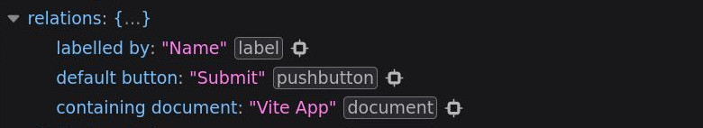
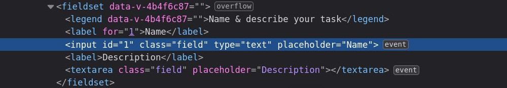

# Identificadores

En la lección anterior digimos que hay una manera de relacionar las entradas con las etiquetas usando identificadores. Esta forma de relacionar elementos **HTML** será útil en la próxima lección cuando veamos los componentes `ErrorMessage`. 

Pasemos directamente a nuestro componente `AppInput` y descubramos cómo crear una relación entre nuestro `<label>` e `<input>` usando un **ID**.

>Puede estar pensando que quizás la opción más obvia sería agregar una propiedad, para que el padre pueda determinar la identificación del elemento, y luego no tenemos que preocuparnos por eso dentro de nuestro componente. Y tendría razón... Pero, ¿y si hubiera una forma en que pudiéramos generar dinámicamente identificadores numéricos únicos para cada componente de nuestro formulario sin tener que recurrir a propiedades manuales?

## UniqueID

Vamos a crear un composable (Vue 3) que nos permita crear estos identificadores únicos dinámicos, o **UUID** para abreviar.

>Es un poco un salto del ritmo del tutorial, pero vamos a hablar un poco sobre la [Composition API](https://vuejs.org/api/composition-api-setup.html) y los [Composables](https://vuejs.org/guide/reusability/composables.html). En cualquier caso, no hay que preocuperse demasiado, va a ser muy sencillo.

Sigamos adelante y creemos un archivo `useUniqueID.ts` dentro la carpeta `composables`.

Vamos a ver.

📃`useUniqueId.ts`
```ts
let UUID = 0

export default function useUniqueId () {
  const getID = () => {
    UUID++
    return UUID
  }

  return {
    String(getID)
  }
}
```

Primero declaramos una variable `let` con un valor predeterminado en `0`. Esto aumentará a medida que creamos más y más componentes: el primer componente tendrá una identificación de `1`, el segundo de `2`, y así sucesivamente.

Vamos a exportar una función `UniqueId`. Cuando se ejecuta, esta función devolverá un objeto que contiene una función bajo la propiedad `getID`. Esta función aumentará en `1` el contador `UUID` global y lo devolverá.

Sepa también que hay muchas bibliotecas de `UUID` que puede usar en lugar de esta solución personalizada, pero queríamos mostrarle lo fácil que puede ser.

Veamos esto en acción para entenderlo mejor, observando `AppInput.vue`.

Primero, vamos a importar nuestro nuevo composable.

📃`AppInput.vue`
```vue{2}
<script setup lang="ts">
import useUniqueId from '@/composables/useUniqueId'

// omitted for brevity ...
</script>

<template>
  <!-- // omitted for brevity ... -->
</template>
```

Ahora que lo tenemos listo, podemos generar una nuevo **ID** único dentro del `<script setup>` de nuestro componente. Sigamos adelante y hagamos eso.


📃`AppInput.vue`
```vue{10}
<script setup lang="ts">
import useUniqueId from '@/composables/useUniqueId'

withDefaults(defineProps<{
  // omitted for brevity ...
}>(), {
  // omitted for brevity ...
})

const uuid = useUniqueId().getID()
</script>
```

Tenga en cuenta que estamos ejecutando el composable `useUniqueId`  y luego el método `getID` dentro. Esto nos dará un número de identificación completamente único cada vez que se instancia un componente.

Finalmente, devolvemos un objeto con el `uuid` para que podamos usarlo en nuestra plantilla.

Hablando de eso, volvamos al `template`  y atemos el `label` y el `input`. Para lograr esto, necesitamos darle al elemento `input` un valor de atributo `id`. Vincularemos el `id` a nuestro `uuid`. Una vez que tenemos declarado el `input` con su propio **ID** único, ahora podemos decirle al `label` que describe el `input` estableciendo el atributo `for` del `label`.

>Nota: Todos estos son atributos de vainilla **HTML**, no hay magia loca de Vue aquí aparte de la facilidad de vincularlos a todos.

📃`AppInput.vue`
```vue{2,9}
<template>
  <label :for="uuid" v-if="label">{{ label }}</label>
  <input
    v-bind="$attrs"
    :value="modelValue"
    :placeholder="label"
    @input="$emit('update:modelValue', ($event.target as HTMLInputElement).value)"
    class="field"
    :id="uuid"  
  >
</template>
```

Vuelva al navegador. Lo primero que queremos señalar es que la señal de advertencia en nuestro campo se ha ido. Y si revisamos un poco debajo de  donde dice `relations` dentro de las `Properties` accesibles, podemos ver ahora que muestra una nueva entrada: etiquetada por: **'Name'**. Si pasa el cursor sobre este elemento, ahora puede ver en el navegador a qué elemento se refiere exactamente. Limpio, ¿verdad?



Ahora, si echamos un vistazo a la pestaña del inspector y observamos nuestros elementos de entrada, podemos ver que se les han asignado automáticamente el identificador `'1'`, respectivamente.



## Terminando

Todavía necesitamos agregar un `uuid` a nuestros componentes `Checkbox`, `Radio`, `Select` y `Textarea`. ¿Estás listo para un desafío? Intenta hacer esto tú mismo. Será tan sencillo como replicar exactamente lo que acabamos de hacer aquí con `AppInput`.


